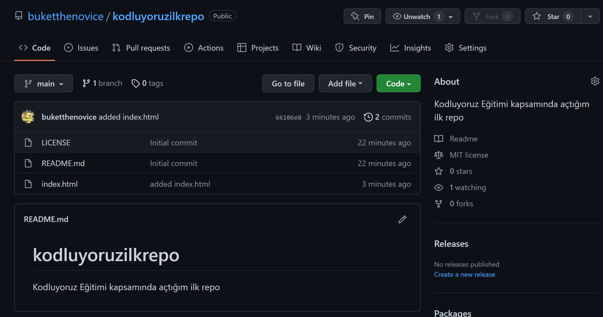
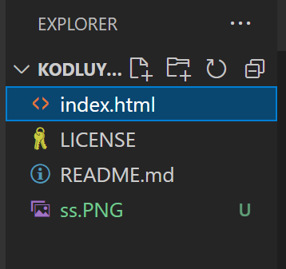

# Kodluyoruz İlk Repo
Bu repo [Kodluyoruz](https://www.kodluyoruz.org/) Front-End Eğitiminde oluşturduğumuz ilk repo. İçerisinde bir adet README dosyası, bir adet de index.html barındırıyor.

## Installation
Öncelikle projeyi cloneladık.
```text
https://github.com/buketthenovice/kodluyoruzilkrepo.git
```
##  Usage
Projeyi cloneladıktan sonra Visual Studio Code programında açtık, istediğimiz değişiklilkeri yaptıktan sonra uygun mesajı yazarak commit ettik.

##  Contributing
Pull requestler kabul edilir. Büyük değişiklikler için, lütfen önce neyi değiştirmek istediğinizi tartışmak için bir konu açınız.
## License
[MIT](https://choosealicense.com/licenses/mit/)

